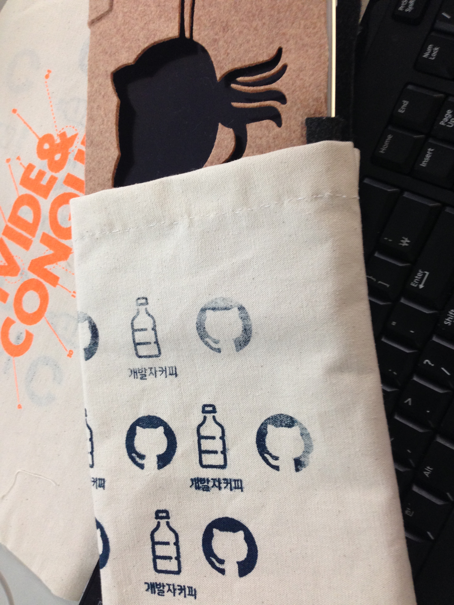

# 실크 스크린 프린터 체험

> 
- 일시 : 2014.03.27 - 수요일 오후 7시 00분 - 10시 00분 
- 장소 : 이태원 릴리쿰
- 참석자 : 윤아님(스승님), 두루님, 형진님, 보나님, 정신님

## 실크 스크린이란

## 만드는 과정

#### 실크스크린 도안을 OHP필름에 인쇄한 모습

#### 실크스크린 도안을 노광한 모습

#### 실크스크린을 노광 완료후 세척한 후 모습

#### 실크스크린 틀을 이용해서 프린트한 모습

## 결과물

> 실크스크린을 도마( 노트북 컴퓨터받침대)와 천에 프린트하였다. 형진님이 도안해주신 "분할과 정복 도안"은 도마의 오토캣과 절묘하게 개발에 대한 메시지를 준다.

#### 천에 인쇄된 실크스크린 1판

#### 천에 인쇄된 실크스크린 2판

#### 천에 인쇄된 실크스크린 3판

> 정신님이 가져가셨다. ^^

#### 천에 인쇄된 실크스크린 4판

> 형진님이 도안해주신 실크스크린

#### 도마에 인쇄된 실크스크린 5판

> 의도하지 않았지만 정말 잘 어울리는 한쌍인 것 같다.

#### 천에 인쇄된 실크 스크린 6판

> 컴퓨터 보호 천으로 활용할 천에 인쇄했다.

#### 천에 최종 결과물 전체

> 내가 소유한 작품

#### 천에 최종 결과물 

> 앞면에는 개발자 커피 로그를 넣고 그 반대면에는 분할과 정복이라는 실크스크린를 천에 인쇄한 모습.
은은하게 비추니 blur효과를 준 것 처럼 보인다.

## 응용

> 인쇄된 천으로 아이패드미니 가방을 만들었다. 평소에 필요했던 물건이라서 이 천을 활용해서 제작했다.
손바느질을 하였다.
- 제작일시 2014.03.26 11:00

#### 아이패드 미니 케이스 제작한 결과물

#### 아이패드 미니 케이스 제작한 결과물(장착한 모습)

## 참조
- [실크스크린 위키피디아](http://en.wikipedia.org/wiki/Screen_printing)
- [기적의 실크 스크린 - 실크스크린 제작 방법](http://www.slideshare.net/coopfab/ss-15926857)